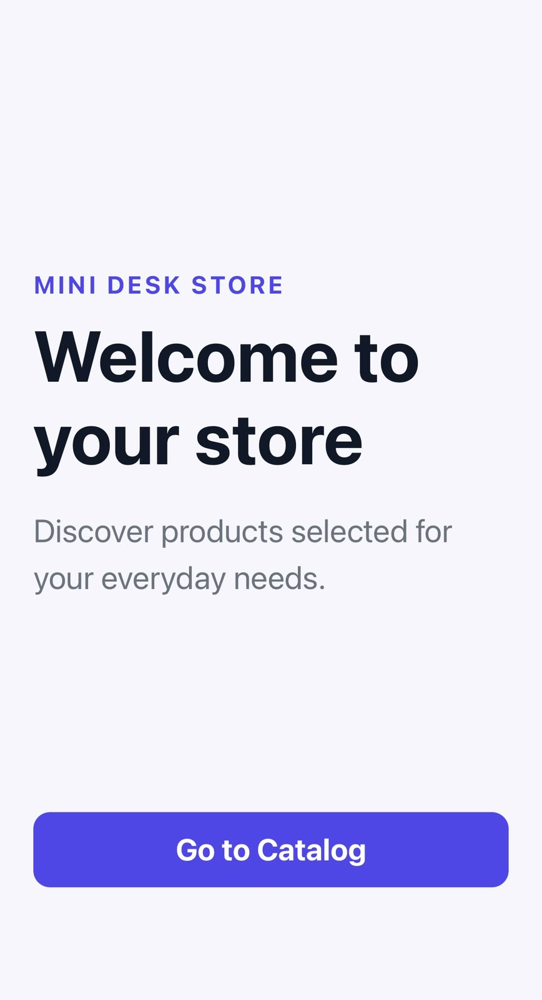
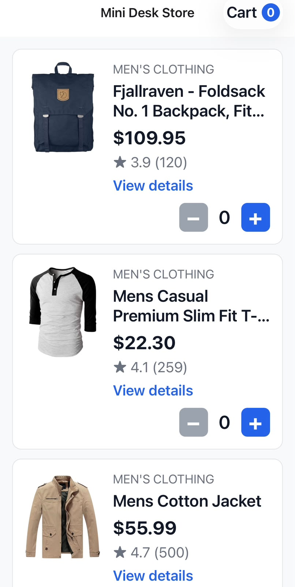
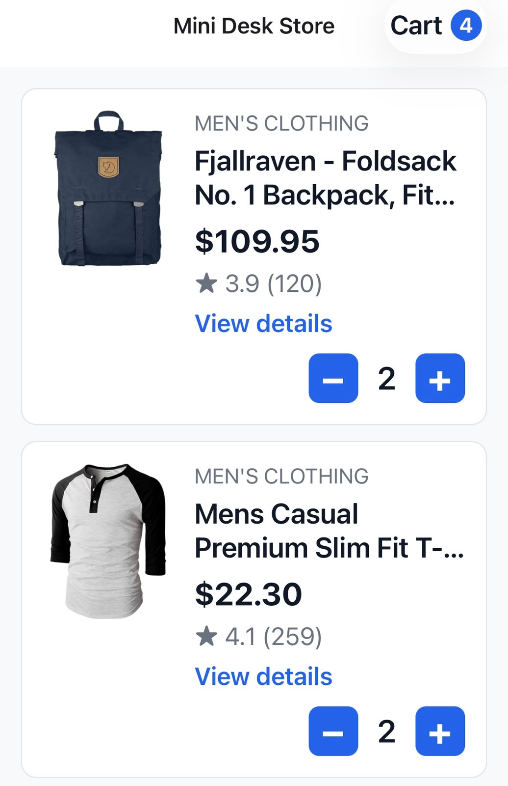
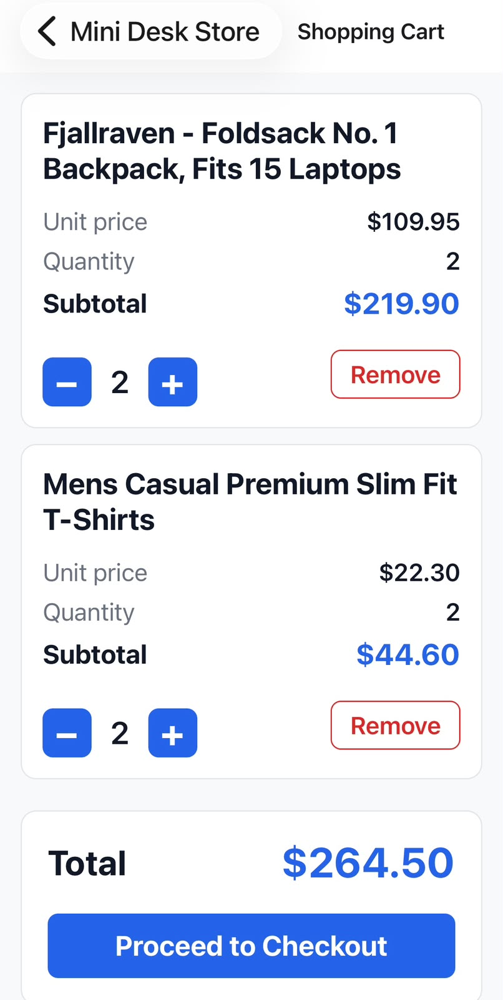
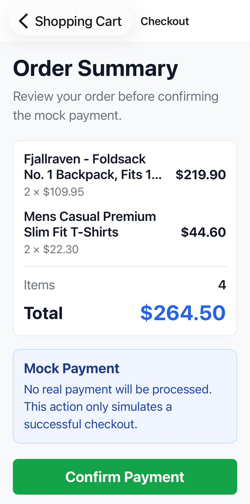
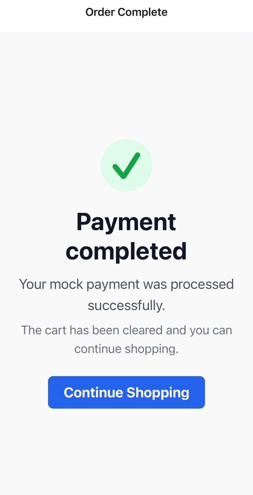
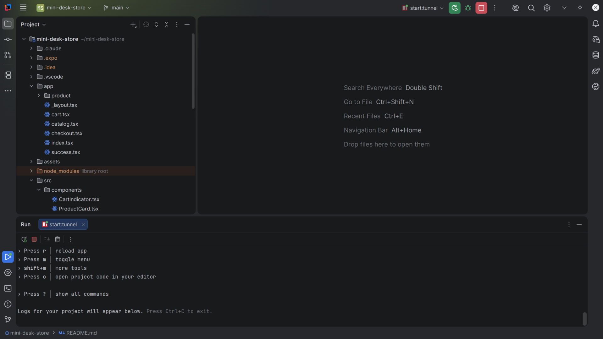

# Mini Desk Store

**Mini Desk Store** es una aplicación móvil desarrollada como prueba técnica utilizando **React Native, Expo y TypeScript**.

La aplicación consume productos desde **Fake Store API** y permite recorrer un flujo completo de compra simulado: desde una pantalla de bienvenida y catálogo de productos hasta el detalle individual, carrito, checkout y confirmación de compra.

El proyecto mantiene una arquitectura intencionalmente sencilla, priorizando código legible, responsabilidades claras y decisiones técnicas proporcionales al alcance de la aplicación.

---

## Presentación del Proyecto

| Campo                          | Información                       |
| :----------------------------- | :-------------------------------- |
| **Nombre**                     | Angel Abraham Lugo Saenz          |
| **Institución de procedencia** | Instituto Tecnológico de Software |
| **Proyecto**                   | Mini Desk Store                   |
| **Tipo**                       | Prueba técnica mobile             |
| **Plataforma**                 | React Native                      |
| **Framework**                  | Expo                              |
| **Lenguaje**                   | TypeScript                        |
| **Navegación**                 | Expo Router                       |
| **Server State**               | TanStack Query                    |
| **Client State**               | Zustand                           |
| **API**                        | Fake Store API                    |
| **Estado**                     | Funcional                         |

---

# Descripción General

Mini Desk Store simula una pequeña tienda móvil.

El usuario inicia en una pantalla de bienvenida desde la cual puede ingresar al catálogo de productos.

Los productos son obtenidos desde Fake Store API y el catálogo contempla explícitamente los diferentes estados de una petición remota:

```text
Loading
Error
Success
```

Desde el catálogo es posible abrir cualquier producto y navegar a una pantalla de detalle utilizando una ruta dinámica basada en su identificador.

La aplicación también cuenta con un carrito global sincronizado entre las diferentes pantallas, controles para aumentar o disminuir cantidades, cálculo de subtotales y total general, además de un flujo de checkout completamente simulado.

El flujo principal es:

```text
Welcome
   ↓
Catalog
   ↓
Product Detail
   ↓
Cart
   ↓
Checkout
   ↓
Success
```

---

# Funcionalidades Implementadas

## Pantalla de Bienvenida

La ruta inicial de la aplicación muestra una pantalla de bienvenida con una acción para ingresar al catálogo.

```text
/
↓
Welcome Screen
↓
Go to Catalog
↓
/catalog
```

La navegación se realiza mediante Expo Router.

---

## Catálogo de Productos

La aplicación obtiene los productos desde:

```text
https://fakestoreapi.com/products
```

Cada producto muestra:

```text
- Imagen.
- Categoría.
- Nombre.
- Precio.
- Rating.
- Controles de cantidad.
```

Para representar el listado se utiliza `FlatList`.

Esto permite mantener una implementación adecuada para listas móviles sin renderizar innecesariamente todos los elementos al mismo tiempo.

---

# Estados de Carga, Error y Éxito

La consulta del catálogo maneja explícitamente los principales estados de una petición remota.

## Loading

Mientras Fake Store API responde, la aplicación muestra:

```text
Loading products...
```

junto con un `ActivityIndicator`.

---

## Error

Si ocurre un problema durante la consulta, se muestra:

```text
Unable to load products
```

junto con el mensaje correspondiente y una acción:

```text
Try again
```

que permite ejecutar nuevamente la consulta.

---

## Success

Cuando la petición termina correctamente, la aplicación muestra el catálogo utilizando los datos recibidos desde Fake Store API.

---

# Detalle de Producto

Al tocar un producto desde el catálogo se navega hacia su detalle.

La aplicación utiliza una ruta dinámica:

```text
/product/[id]
```

Ejemplos:

```text
/product/1
/product/7
/product/20
```

El identificador se obtiene mediante:

```ts
useLocalSearchParams()
```

Posteriormente se convierte a número y se valida antes de realizar la consulta.

El flujo es:

```text
/product/1
   ↓
id = "1"
   ↓
Number(id)
   ↓
useProduct(1)
   ↓
getProductById(1)
   ↓
Fake Store API
```

---

# Acceso Directo al Detalle

La pantalla de detalle **no depende de que el catálogo le envíe el objeto completo del producto**.

El catálogo únicamente navega utilizando el identificador.

Después, la pantalla de detalle realiza su propia consulta mediante:

```text
GET /products/:id
```

Por ejemplo:

```text
/product/7
```

puede resolver el producto correspondiente sin necesidad de haber visitado previamente el catálogo.

Esto evita acoplar la pantalla de detalle al estado anterior de navegación.

---

# Carrito Global

El carrito utiliza **Zustand** como estado global de cliente.

La estructura principal de cada elemento es:

```ts
CartItem {
  product: Product;
  quantity: number;
}
```

Las operaciones principales son:

```text
increment(product)
decrement(productId)
remove(productId)
clearCart()
```

El mismo store es utilizado desde:

```text
Catalog
↕
Product Detail
↕
Cart
↕
Checkout
```

Esto permite mantener las cantidades sincronizadas.

Ejemplo:

```text
Catalog quantity = 2
↓
Open Product Detail
↓
Detail quantity = 2
↓
Increase to 3
↓
Return to Catalog
↓
Catalog quantity = 3
```

---

# Controles de Cantidad

Cada producto utiliza un control reutilizable:

```text
[-] 2 [+]
```

Las reglas principales son:

```text
- Una cantidad nunca puede ser negativa.
- Incrementar un producto nuevo lo agrega con quantity = 1.
- Incrementar un producto existente aumenta quantity.
- Reducir una cantidad de 1 a 0 elimina el producto.
- El botón "-" permanece deshabilitado cuando la cantidad es 0.
```

---

# Indicador Global del Carrito

La aplicación muestra un indicador con el número total de unidades agregadas al carrito.

Ejemplo:

```text
Producto A = 2
Producto B = 3

Indicador = 5
```

Este valor no se almacena como estado adicional.

Se calcula directamente desde los elementos actuales del carrito utilizando `reduce`.

---

# Shopping Cart

La pantalla del carrito muestra por producto:

```text
- Nombre.
- Precio unitario.
- Cantidad.
- Subtotal.
- Controles + / -.
- Acción Remove.
```

El subtotal se calcula como:

```text
subtotal = price * quantity
```

El total general se obtiene mediante:

```ts
items.reduce(
  (sum, item) =>
    sum + item.product.price * item.quantity,
  0
)
```

Cuando no existen productos se muestra:

```text
Your cart is empty
```

junto con una acción para regresar al catálogo.

---

# Checkout

El proyecto incluye un checkout simulado.

No existe ninguna integración con un sistema de pago real.

El flujo es:

```text
Cart
↓
Proceed to Checkout
↓
Checkout
↓
Confirm Payment
↓
Success
```

La pantalla muestra:

```text
- Productos.
- Cantidades.
- Precio unitario.
- Subtotales.
- Número total de items.
- Total general.
- Aviso de pago simulado.
```

Si el carrito está vacío:

```text
items.length === 0
```

la aplicación muestra:

```text
Checkout unavailable
```

y no permite confirmar el pago.

---

# Confirmación de Compra

Al confirmar el checkout:

```text
Confirm Payment
↓
clearCart()
↓
markCheckoutCompleted()
↓
router.replace('/success')
```

El carrito se limpia y la navegación utiliza `replace` para evitar que el checkout ya procesado permanezca como pantalla inmediatamente anterior.

---

# Protección de la Pantalla Success

La aplicación mantiene un estado:

```text
checkoutCompleted
```

La pantalla de éxito verifica ese valor antes de mostrar una operación completada.

Si alguien intenta acceder directamente a:

```text
/success
```

sin haber completado un checkout válido, la aplicación redirige al usuario hacia el flujo permitido.

Esto evita mostrar información incorrecta como:

```text
Payment completed
```

si realmente no ocurrió ningún checkout.

---

# Tecnologías Utilizadas

| Tecnología         | Uso dentro del proyecto              |
| :----------------- | :----------------------------------- |
| **React Native**   | Desarrollo de la aplicación móvil    |
| **Expo SDK 54**    | Entorno de desarrollo                |
| **TypeScript**     | Tipado estático                      |
| **Expo Router**    | Navegación y rutas dinámicas         |
| **TanStack Query** | Server state, caché y consultas HTTP |
| **Zustand**        | Estado global del carrito            |
| **Fake Store API** | Fuente remota de productos           |
| **Fetch API**      | Comunicación HTTP                    |
| **Git**            | Control de versiones                 |
| **GitHub**         | Repositorio remoto                   |
| **Expo Go**        | Pruebas en dispositivo físico        |

---

# Versiones Utilizadas

El proyecto fue desarrollado utilizando:

```text
Node.js: v24.19.0
Expo SDK: 54
```

Node fue gestionado localmente mediante NVM.

Estas versiones representan el entorno utilizado durante el desarrollo.

El proyecto no depende de una ruta específica de Node ni de la máquina donde fue creado.

---

# Requisitos para Ejecutar el Proyecto

Se requiere:

```text
- Git
- Node.js
- npm
- Expo
- Expo Go para ejecución en dispositivo físico
```

No es obligatorio utilizar IntelliJ IDEA.

El proyecto puede abrirse desde cualquier IDE compatible con proyectos React Native / Node.js.

Ejemplos:

```text
- IntelliJ IDEA
- WebStorm
- Visual Studio Code
- Android Studio
```

---

# Instalación

Clonar el repositorio:

```bash
git clone https://github.com/Angel-Lugo97/mini-desk-store.git
```

Entrar al proyecto:

```bash
cd mini-desk-store
```

Instalar las dependencias registradas en `package-lock.json`:

```bash
npm ci
```

También puede utilizarse:

```bash
npm install
```

aunque `npm ci` ofrece una instalación más reproducible basada directamente en el lockfile.

---

# Ejecutar el Proyecto

Durante el desarrollo, el proyecto fue ejecutado principalmente mediante túnel para facilitar la conexión con un iPhone físico utilizando Expo Go.

Ejecutar:

```bash
npm run start:tunnel
```

El script ejecuta:

```bash
expo start --tunnel
```

También puede utilizarse directamente:

```bash
npx expo start --tunnel
```

Una vez iniciado Metro:

```text
1. Abrir Expo Go.
2. Escanear o abrir el proyecto mediante el QR generado.
3. Esperar la compilación de Metro.
4. Probar la aplicación.
```

---

# Limpiar Caché de Expo

Si Metro mantiene información anterior o Expo Router todavía no reconoce una nueva ruta:

```bash
npx expo start --clear --tunnel
```

Esto resulta especialmente útil después de agregar rutas nuevas.

---

# Validaciones Técnicas

TypeScript:

```bash
npx tsc --noEmit
```

Lint:

```bash
npm run lint
```

Comprobación de diferencias:

```bash
git diff --check
```

Diagnóstico de Expo:

```bash
npx expo-doctor
```

---

# Estructura del Proyecto

```text
mini-desk-store/
│
├── app/
│   ├── _layout.tsx
│   ├── index.tsx
│   ├── catalog.tsx
│   ├── cart.tsx
│   ├── checkout.tsx
│   ├── success.tsx
│   │
│   └── product/
│       └── [id].tsx
│
├── src/
│   ├── components/
│   │   ├── ProductCard.tsx
│   │   ├── QuantityControl.tsx
│   │   └── CartIndicator.tsx
│   │
│   ├── hooks/
│   │   ├── useProducts.ts
│   │   └── useProduct.ts
│   │
│   ├── services/
│   │   └── productsApi.ts
│   │
│   ├── store/
│   │   └── cartStore.ts
│   │
│   ├── types/
│   │   ├── product.ts
│   │   └── cart.ts
│   │
│   └── utils/
│       └── queryRetry.ts
│
├── docs/
│   └── screenshots/
│       ├── welcome.jpeg
│       ├── catalog.jpeg
│       ├── catalog-quantities.jpeg
│       ├── cart.jpeg
│       ├── checkout.jpeg
│       ├── success.jpeg
│       └── intellij-run.png
│
├── package.json
├── package-lock.json
├── tsconfig.json
└── README.md
```

---

# ¿Por Qué Esta Organización?

La arquitectura fue mantenida intencionalmente sencilla.

No se buscó agregar la mayor cantidad posible de capas, sino separar responsabilidades reales dentro de la aplicación.

---

## `app/`

Contiene las pantallas y rutas de Expo Router.

```text
app/index.tsx
→ /

app/catalog.tsx
→ /catalog

app/product/[id].tsx
→ /product/:id

app/cart.tsx
→ /cart

app/checkout.tsx
→ /checkout

app/success.tsx
→ /success
```

---

## `src/components/`

Contiene componentes visuales reutilizables.

```text
ProductCard
QuantityControl
CartIndicator
```

Esto evita repetir comportamiento o interfaz.

---

## `src/hooks/`

Contiene hooks encargados de conectar la interfaz con los datos remotos.

```text
useProducts
useProduct
```

Estos hooks encapsulan la integración con TanStack Query.

---

## `src/services/`

Contiene la comunicación HTTP.

```text
productsApi.ts
```

El flujo conceptual es:

```text
ProductsScreen
↓
useProducts
↓
getProducts
↓
Fake Store API
```

---

## `src/store/`

Contiene el estado global del cliente.

```text
cartStore.ts
```

Aquí Zustand mantiene:

```text
- Productos del carrito.
- Cantidades.
- Acciones.
- Estado del checkout.
```

---

## `src/types/`

Contiene tipos TypeScript compartidos.

```text
Product
ProductRating
CartItem
```

---

## `src/utils/`

Contiene pequeñas funciones auxiliares.

Actualmente:

```text
queryRetry.ts
```

controla la política de reintentos de TanStack Query.

---

## `docs/screenshots/`

Contiene únicamente evidencia visual utilizada por la documentación.

Estas imágenes no forman parte de los assets de la aplicación.

Separarlas en `docs/` evita mezclar recursos de ejecución con archivos destinados únicamente al README.

---

# Decisiones Técnicas

## 1. ¿Por qué React Native y Expo?

React Native permite desarrollar una aplicación móvil utilizando React y TypeScript.

Expo reduce la configuración nativa necesaria y facilita la ejecución en dispositivos físicos mediante Expo Go.

Para el tamaño de esta prueba técnica resulta suficiente y permite concentrarse en la funcionalidad solicitada.

---

## 2. ¿Por qué TypeScript?

TypeScript define contratos claros para estructuras como:

```text
Product
ProductRating
CartItem
```

Esto permite detectar problemas antes de ejecutar la aplicación.

TypeScript no valida automáticamente el JSON recibido desde Fake Store API en runtime.

Para esta prueba se confía en el contrato proporcionado por la API.

En un entorno de producción podría añadirse:

```text
Zod
Valibot
```

o validación manual.

---

## 3. ¿Por qué Expo Router?

Expo Router proporciona navegación basada en archivos.

Ejemplo:

```text
app/catalog.tsx
→ /catalog

app/product/[id].tsx
→ /product/:id
```

Esto facilita especialmente la implementación y comprensión de rutas dinámicas.

---

## 4. ¿Por qué el detalle consulta nuevamente por ID?

La pantalla de detalle no necesita recibir el objeto completo desde el catálogo.

Únicamente obtiene el identificador desde la URL.

```text
/product/10
↓
id = 10
↓
GET /products/10
```

Esto permite abrir directamente una ruta dinámica y reduce el acoplamiento entre pantallas.

---

## 5. ¿Por qué TanStack Query?

Los productos son información proveniente de un servidor externo.

Por ello representan **server state**.

TanStack Query permite manejar:

```text
- Loading.
- Error.
- Success.
- Cache.
- staleTime.
- Retry.
- Refetch.
```

sin recrear manualmente toda esta lógica.

---

## 6. ¿Cómo se maneja el caché?

El catálogo utiliza una clave:

```ts
['products']
```

Los detalles utilizan:

```ts
['product', productId]
```

Los datos tienen un `staleTime` de:

```text
5 minutos
```

Durante ese periodo TanStack Query puede reutilizar datos disponibles según el estado de la consulta.

---

## 7. ¿Cómo funcionan los reintentos?

El proyecto utiliza:

```text
shouldRetryQuery
```

con una regla general:

```text
HTTP 4xx
→ no retry

Errores de red o HTTP 5xx
→ hasta 2 retries
```

Un error como 404 normalmente no se solucionará repitiendo inmediatamente la misma petición.

Un error temporal de red o servidor sí puede recuperarse.

---

## 8. ¿Por qué Zustand?

El carrito representa estado de cliente compartido entre:

```text
Catalog
Product Detail
Cart
Checkout
```

Zustand permite crear un store global pequeño y sencillo sin introducir configuración innecesaria.

---

## 9. ¿Por Qué No Redux?

Redux es una solución válida para aplicaciones con estados globales complejos.

En Mini Desk Store el estado global es reducido.

Principalmente se necesita:

```text
items
checkoutCompleted
```

junto con algunas acciones.

Agregar Redux aumentaría la configuración sin aportar una ventaja proporcional al tamaño actual del proyecto.

---

## 10. Server State vs Client State

El proyecto diferencia claramente ambos tipos de estado.

### Server State

```text
Productos
↓
TanStack Query
```

### Client State

```text
Carrito
Checkout
↓
Zustand
```

Los productos requieren caché, refetch y manejo de errores HTTP.

El carrito necesita sincronización entre pantallas.

---

## 11. ¿Por Qué Fetch en Lugar de Axios?

La aplicación consume una API pequeña y únicamente necesita peticiones HTTP sencillas.

`fetch` es suficiente para este escenario y evita agregar una dependencia adicional.

---

## 12. ¿Por Qué Existe una Capa HTTP Separada?

Las pantallas no realizan directamente:

```ts
fetch(...)
```

La comunicación se encuentra en:

```text
src/services/productsApi.ts
```

Esto mantiene un flujo:

```text
UI
↓
Hook
↓
Service
↓
API
```

---

## 13. Manejo de Errores HTTP

El servicio utiliza:

```text
ApiError
```

con información como:

```text
message
status
```

Esto permite distinguir:

```text
404
→ Product not found

500 / Network
→ Unable to load product
```

También permite controlar mejor la estrategia de retry.

---

## 14. ¿Por Qué No Guardar los Totales en Zustand?

Valores como:

```text
subtotal
total
totalItems
```

pueden calcularse directamente desde el estado existente.

Por ello se consideran **estado derivado**.

Ejemplo:

```text
subtotal = price * quantity
```

Guardar esos valores nuevamente en Zustand podría producir información duplicada y desincronizada.

---

## 15. ¿Por Qué Utilizar `replace` Después del Checkout?

Después de confirmar el pago se utiliza:

```text
router.replace('/success')
```

Esto evita mantener el checkout procesado como pantalla inmediatamente anterior.

---

## 16. ¿Por Qué Existe `checkoutCompleted`?

Deshabilitar únicamente el botón Back no impide que alguien intente abrir directamente:

```text
/success
```

El estado:

```text
checkoutCompleted
```

permite comprobar si realmente ocurrió un checkout antes de mostrar la confirmación.

---

## 17. ¿Por Qué No Utilizar una Arquitectura Más Compleja?

No se agregaron capas como:

```text
domain/
repositories/
use-cases/
adapters/
infrastructure/
```

porque el tamaño actual de la aplicación no las necesita.

Agregar abstracciones únicamente para demostrar patrones aumentaría la complejidad sin resolver un problema real.

La filosofía utilizada fue:

```text
Problema real
↓
Solución sencilla
↓
Código entendible
↓
Responsabilidad clara
↓
Requisito cumplido
```

---

# Manejo General del Estado

```text
SERVER STATE
│
└── TanStack Query
    ├── Products
    └── Product Detail


CLIENT STATE
│
└── Zustand
    ├── Cart Items
    ├── Quantities
    └── Checkout Completed
```

---

# Manejo de Errores

La aplicación contempla:

```text
API loading
→ ActivityIndicator

API error
→ mensaje + retry

404
→ Product not found

Otros errores
→ Unable to load product

Carrito vacío
→ Empty Cart

Checkout vacío
→ Checkout unavailable

Success inválido
→ Redirect
```

---

# Navegación

| Ruta            | Pantalla        |
| :-------------- | :-------------- |
| `/`             | Welcome         |
| `/catalog`      | Product Catalog |
| `/product/[id]` | Product Detail  |
| `/cart`         | Shopping Cart   |
| `/checkout`     | Checkout        |
| `/success`      | Order Complete  |

---

# Portabilidad del Proyecto

El repositorio no depende de IntelliJ IDEA.

Los archivos locales del IDE:

```text
.idea/
```

se encuentran ignorados mediante `.gitignore`.

También se ignoran archivos generados o locales como:

```text
node_modules/
.expo/
dist/
ios/
android/
```

El repositorio tampoco contiene rutas absolutas hacia la computadora utilizada durante el desarrollo.

Un desarrollador debería poder ejecutar:

```bash
git clone https://github.com/Angel-Lugo97/mini-desk-store.git
cd mini-desk-store
npm ci
npm run start:tunnel
```

independientemente del IDE utilizado.

---

# Git y Control de Versiones

El proyecto fue desarrollado mediante commits pequeños asociados a funcionalidades concretas.

Ejemplos:

```text
chore: initialize Expo TypeScript application

chore: configure base application navigation

feat: implement product catalog with API caching

feat: implement global cart state and quantity controls

feat: add dynamic product detail screen

feat: implement cart summary and totals

feat: implement mock checkout flow

fix: handle API and navigation edge cases

refactor: move product catalog to dedicated route

feat: add welcome screen and catalog navigation
```

Esto permite entender la evolución del proyecto y revisar cambios de forma independiente.

---

# Qué se Dejó Fuera

Algunas características fueron dejadas fuera intencionalmente porque no eran necesarias para resolver el alcance principal de la prueba.

```text
- Login.
- Registro de usuarios.
- Backend propio.
- Base de datos propia.
- Pago real.
- Favoritos.
- Búsqueda.
- Filtros.
- Dark mode.
- Animaciones avanzadas.
- Persistencia con AsyncStorage.
- Validación runtime con Zod.
- CI/CD.
- Suite completa de tests.
```

Estas características no eran necesarias para demostrar los requisitos principales de la aplicación.

---

# Qué Haría con Más Tiempo

## Tests Automatizados

Añadiría pruebas principalmente para:

```text
- increment
- decrement
- remove
- clearCart
- quantity 1 → 0
- totalItems
- subtotales
- total general
- checkoutCompleted
- retry
```

---

## Validación Runtime

TypeScript describe el contrato esperado, pero no valida los datos recibidos durante ejecución.

Con más tiempo incorporaría:

```text
Zod
```

o una alternativa similar.

---

## Persistencia del Carrito

El carrito pertenece actualmente a la sesión activa.

Podría utilizarse:

```text
AsyncStorage
```

para mantener los productos después de cerrar completamente la aplicación.

---

## Búsqueda y Filtros

En un catálogo mayor agregaría:

```text
- Búsqueda por nombre.
- Filtro por categoría.
- Ordenamiento por precio.
- Ordenamiento por rating.
```

---

## Mejoras Visuales

Se podrían agregar:

```text
- Skeleton loaders.
- Animaciones.
- Mejor feedback al agregar productos.
- Mejoras responsive.
- Accesibilidad.
- Estados vacíos más elaborados.
```

---

## CI/CD

Se podría añadir una pipeline automática para ejecutar:

```bash
npx tsc --noEmit
npm run lint
```

en cada Pull Request o push relevante.

---

# Limitaciones Actuales

Fake Store API es un servicio externo.

La disponibilidad del catálogo depende de que dicho servicio responda correctamente.

El checkout es únicamente demostrativo y no representa una integración financiera real.

El carrito tampoco se persiste al cerrar completamente la aplicación.

---

# Evidencia Visual de Ejecución

Las siguientes capturas muestran Mini Desk Store ejecutándose en un dispositivo físico mediante **Expo Go**.

---

## Welcome y Catálogo

|                                         Pantalla de bienvenida                                        |                                         Catálogo                                        |
| :---------------------------------------------------------------------------------------------------: | :-------------------------------------------------------------------------------------: |
|  |  |
|                                Pantalla inicial con acceso al catálogo.                               |                        Productos obtenidos desde Fake Store API.                        |

---

## Estado Global del Carrito

<p align="center">
  
</p>

<p align="center">
Las cantidades de los productos y el indicador del carrito permanecen sincronizados mediante Zustand.
</p>

---

## Carrito y Checkout

|                                       Shopping Cart                                       |                                         Checkout                                         |
| :---------------------------------------------------------------------------------------: | :--------------------------------------------------------------------------------------: |
|  |  |
|           El carrito muestra cantidades, subtotales, controles y total general.           |           El checkout presenta un resumen antes de confirmar el pago simulado.           |

---

## Confirmación de Compra

<p align="center">
  
</p>

<p align="center">
Después de confirmar el checkout, el carrito se limpia y se muestra la pantalla de operación completada.
</p>

---

## Ejecución desde IntelliJ IDEA

El proyecto puede iniciarse directamente desde IntelliJ IDEA utilizando una configuración de ejecución asociada al script npm:

```bash
npm run start:tunnel
```

<p align="center">
  
</p>

La configuración del IDE es únicamente una comodidad de desarrollo.

El proyecto continúa siendo independiente de IntelliJ IDEA y puede ejecutarse desde cualquier entorno compatible con Node.js y Expo.

---

# Flujo Principal de Validación

Para comprobar el funcionamiento general:

```text
1. Abrir la aplicación.
2. Visualizar Welcome.
3. Entrar al Catalog.
4. Esperar la carga de productos.
5. Abrir un Product Detail.
6. Aumentar la cantidad.
7. Verificar el Cart Indicator.
8. Abrir Cart.
9. Verificar subtotales y total.
10. Proceed to Checkout.
11. Confirm Payment.
12. Visualizar Success.
13. Continue Shopping.
14. Verificar que el carrito está vacío.
```

También puede verificarse directamente:

```text
/product/:id
```

para comprobar que el detalle no depende de visitar previamente el catálogo.

---

# Principios Seguidos Durante el Desarrollo

```text
Problema real
↓
Solución sencilla
↓
Código entendible
↓
Responsabilidad clara
↓
Requisito cumplido
```

La intención principal fue construir una solución funcional, explicable y fácil de mantener sin agregar complejidad innecesaria.

---

# Conclusión

Mini Desk Store implementa un flujo completo de tienda móvil utilizando React Native, Expo y TypeScript.

La aplicación separa los datos remotos y el estado del cliente utilizando **TanStack Query** y **Zustand**, respectivamente.

Expo Router gestiona la navegación y las rutas dinámicas, mientras que la comunicación con Fake Store API se mantiene separada dentro de una capa HTTP basada en `fetch`.

Las decisiones técnicas se orientaron a mantener una solución pequeña, legible y proporcional al problema.

El flujo principal implementado es:

```text
Welcome
→ Catalog
→ Product Detail
→ Cart
→ Checkout
→ Success
```

Además, el proyecto incluye:

```text
- Loading.
- Error.
- Success.
- Caché.
- Retry.
- Rutas dinámicas.
- Acceso directo al detalle.
- Estado global sincronizado.
- Totales derivados.
- Checkout simulado.
- Protección de navegación.
- Evidencia visual.
- Portabilidad entre diferentes IDEs.
```

El resultado es una aplicación funcional que cumple el flujo principal solicitado manteniendo una arquitectura sencilla y fácil de explicar.
